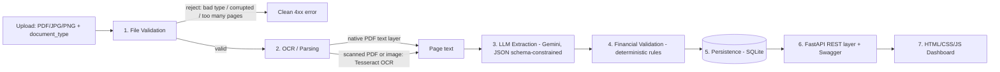

# Document Intelligence Platform

Intelligent extraction, validation and API platform for invoices and
consolidated financial statements (Balance Sheet, Profit & Loss, Cash Flow),
built for the NeoStats AI Engineer Intern technical case study.

## 1. Solution overview & architecture



Each stage is a separate module (`app/validation`, `app/ocr`,
`app/extraction`, `app/financial_validation`, `app/db`) with a single
responsibility, wired together by `app/pipeline.py`. This separation is
deliberate, not incidental:

- **File Validation** is a pure input-control gate — it rejects bad uploads
  *before* any OCR/LLM cost is spent. It does not try to understand the
  document.
- **OCR/Parsing** turns bytes into plain page text and nothing else. It
  tries native PDF text extraction first, and only falls back to rasterizing
  pages and running Tesseract OCR when there's no usable text layer (this
  matters: the Balance Sheet / P&L / Cash Flow PDFs in the provided dataset
  are scans with **no embedded text layer at all** — confirmed with
  `pdffonts`, zero fonts — so they always go through the OCR path; invoice
  images always do too).
- **Extraction** is the only stage that calls an LLM. It receives OCR text
  (not images) plus page numbers, and returns a JSON-schema-constrained
  result: a flexible list of `{name, value, page, source_text}` fields
  (not a fixed hardcoded field list, so unusual line items are still
  captured) plus structured tables.
- **Financial Validation** is deliberately **not** LLM-based — it's plain
  Python arithmetic. An LLM should not be the one deciding whether a
  balance sheet balances. Each check looks up the fields it needs by name,
  and returns `NOT_APPLICABLE` (never a guess) if a required field wasn't
  extracted.
- **Persistence** is SQLite via SQLAlchemy — reprocessing the same
  `document_name` updates its record in place, so `GET /documents/{name}`
  always returns the latest result.

## 2. Technology stack & why

| Concern | Choice | Reason |
|---|---|---|
| API framework | FastAPI | Native async, auto-generates Swagger/OpenAPI (mandatory requirement), first-class Pydantic validation |
| OCR | Tesseract + Poppler (`pdf2image`, `pytesseract`) | Free, local, no API key/rate limits — important since the financial statement PDFs in the dataset are scans with no text layer, and evaluation may re-run processing many times |
| LLM / structuring | Google Gemini (`gemini-3.5-flash-lite`), structured JSON output mode | Free tier available, native support for schema-constrained JSON responses (no fragile regex/prompt-only JSON parsing) |
| Financial validation | Plain Python, rule-based | Deterministic, explainable, zero hallucination risk for arithmetic checks |
| Database | SQLite via SQLAlchemy | Zero external service to provision — ships as a file, easy on free-tier deployment, swappable for Postgres via `DATABASE_URL` |
| Frontend | Static HTML/CSS/vanilla JS | Matches the spec exactly (no separate frontend stack required); calls the deployed API directly |
| Deployment | Docker on Render (free tier) | Docker guarantees Tesseract/Poppler system binaries are present, which a plain buildpack may not provide |

## 3. Local setup

```bash
git clone <your-repo-url>
cd document-intelligence-platform

# System dependencies (skip if already installed, e.g. via Docker)
# Ubuntu/Debian: sudo apt-get install tesseract-ocr poppler-utils
# Mac: brew install tesseract poppler

python -m venv .venv && source .venv/bin/activate
pip install -r requirements.txt

cp .env.example .env
# edit .env and set GEMINI_API_KEY

uvicorn app.main:app --reload
# API + frontend both served at http://localhost:8000
# Swagger UI at http://localhost:8000/docs
```

Run tests:
```bash
pytest tests/ -v
```

Generate sample outputs from a local dataset folder:
```bash
python scripts/generate_samples.py ./path/to/dataset
```

## 4. Environment variables

See `.env.example` for the full list (no real secrets committed). Key ones:

| Variable | Purpose |
|---|---|
| `GEMINI_API_KEY` | Google Gemini API key used for the extraction step |
| `GEMINI_MODEL` | Gemini model name (default `gemini-3.5-flash-lite`) |
| `MAX_PAGES` | Max pages allowed per document (default 3) |
| `DATABASE_URL` | SQLAlchemy DB URL (default local SQLite file) |

## 5. Deployed application

- Frontend: `<fill in after deploying>`
- Backend API base URL: `<fill in after deploying>`
- Swagger/OpenAPI docs: `<backend-url>/docs`
- Public GitHub repo: `<fill in>`

## 6. API reference

### `POST /documents/process`
Multipart upload. Synchronously validates, OCRs, extracts, validates, and
persists a document.

```bash
curl -X POST "<backend-url>/documents/process" \
  -F "document_type=INVOICE" \
  -F "file=@sample_invoice.jpg"
```

### `GET /documents/{document_name}`
Returns the latest processed result for that document name.

```bash
curl "<backend-url>/documents/sample_invoice.jpg"
```

### `GET /documents`
Returns all processed documents (backs the dashboard list).

```bash
curl "<backend-url>/documents"
```

### `GET /health`
Liveness check.

All error responses share a consistent shape:
```json
{ "error_code": "FILE_VALIDATION_FAILED", "message": "...", "details": { } }
```

## 7. OCR / LLM services used

- OCR/parsing: Tesseract OCR (local, open-source) + Poppler for PDF page
  rasterization, with native PDF text extraction (`pypdf`) attempted first.
- LLM: Google Gemini (`gemini-3.5-flash-lite`), free tier, structured JSON output
  mode.

## 8. Confidence scoring

Not implemented. Per the spec this is optional; the effort was instead put
into extraction completeness, grounding (page number + source text snippet
per field) and deterministic financial validation, which the spec weights
more heavily.

## 9. Financial validation rules & tolerance

All checks use an absolute tolerance of **1.0** (in the document's own
reporting units) to allow for rounding, and return `NOT_APPLICABLE` (never
a guess) if a required field wasn't extracted from the document.

| Document type | Check |
|---|---|
| Balance Sheet | `total_assets == total_capital_and_liabilities` |
| Profit & Loss | `total_income - total_expenses == net_profit` |
| Cash Flow | `opening_cash_balance + operating_cf + investing_cf + financing_cf == closing_cash_balance` |
| Invoice | `net_worth + vat_amount == gross_worth` |

## 10. Database / persistence

SQLite file at `./data/documents.db` (created automatically on startup),
accessed through SQLAlchemy. One row per `document_name`; reprocessing the
same name updates the row in place. Swap `DATABASE_URL` to a Postgres
connection string for production use with no code changes.

## 11. Known limitations

- Document type is supplied by the caller, not auto-classified (explicitly
  out of scope per the case study).
- Tesseract's OCR accuracy degrades on heavily skewed, stamped, or very
  low-resolution scans — some of the provided receipt images have exactly
  this issue, which is a good demo of the `NOT_APPLICABLE`/missing-field
  path.
- Confidence scoring is not implemented.
- No document-versioning history (only the latest result per document name
  is retained).
- Financial field lookups use keyword matching on the LLM's field names,
  which is more flexible than hardcoded labels but not infallible on
  extremely unusual document layouts.
- For consolidated financial statements, `Total Income - Total Expenses`
  correctly computes profit *before* minority interest, but "net profit"
  is often reported *after* minority interest is deducted — this produces
  a legitimate `FAIL` (verified against a real sample: variance exactly
  matched the minority interest line). A more precise check would target
  "Net Profit before Minorities' Interest" specifically for consolidated
  statements rather than a generic `net_profit` label.

## 12. What would change for production

- Move from SQLite to managed Postgres with connection pooling.
- Add async/background job processing (e.g. a task queue) instead of
  synchronous processing, with a status-polling endpoint.
- Add authentication/authorization on the API.
- Add per-field confidence scoring calibrated against a labeled validation
  set.
- Add document-type auto-classification as a pre-step.
- Retain full version history per document rather than overwrite-in-place.
- Add retries/circuit-breaking around the Gemini call and a fallback OCR
  provider.

## 13. AI coding assistants used

Claude (Anthropic) was used throughout to design the architecture, write
the extraction/validation/API code, and generate this documentation.

## 14. Repository structure

```
app/
  main.py                     FastAPI app, startup, centralized exception handlers
  config.py                   Environment-driven settings
  exceptions.py                Custom exception hierarchy
  logging_config.py            Logging setup
  pipeline.py                  Orchestrates the 5-stage pipeline
  api_models.py                Public API response schemas
  api/
    routes_documents.py        POST/GET document endpoints
    routes_health.py            Health check
  validation/
    file_validation.py          Stage 1: input-control gate
  ocr/
    ocr_service.py               Stage 2: native text + Tesseract OCR
  extraction/
    schemas.py                    LLM output schema (Pydantic)
    prompts.py                    Per-document-type prompt templates
    llm_extractor.py              Stage 3: Gemini structured-output call
  financial_validation/
    validators.py                  Stage 4: deterministic rule checks
  db/
    models.py, database.py, crud.py   Stage 5: SQLAlchemy persistence
frontend/
  index.html, style.css, app.js  Upload form + dashboard + detail view
tests/
  test_file_validation.py
  test_financial_validation.py
  test_api_flow.py
scripts/
  generate_samples.py           Batch-process a dataset folder -> sample_outputs/
sample_outputs/                 Sample JSON outputs (generate via the script above)
Dockerfile
requirements.txt
.env.example
```